<!--
-->
## è½»é‡çº§ROS1/ROS2移动机器人人机交互软件


<!-- 
<a href="https://www.bilibili.com/video/BV14h4y1w7TC">

</a>
<a href="https://www.bilibili.com/video/BV11h4y1y74H">

</a>
-->


本项目基äºQt5å¼€å‘，基äºCMake进行æ„建，å¯ä»¥å®ç°ä¸€å¥—代ç åŒæ—¶åœ¨ROS1/ROS2系统中使用(本项目已æ¥å…¥CI,ä¿è¯å¤šROS版本/系统版本å¯ç”¨æ€§)

软件在编译时会自动识别ç¯å¢ƒå˜é‡ä¸­çš„ROS1/ROS2ç¯å¢ƒå¹¶è¿›è¡Œæ„建，å®ç°ROS通信ä¸ç•Œé¢éš”离

软件所有功能å‡ä¸ºè‡ªè¡Œç»˜åˆ¶å®ç°,å› æ­¤å¯ä»¥è½»æ¾è¿è¡Œåœ¨ä¸€äº›æ€§èƒ½æ¯”较ä½çš„边缘设备

功能/TODO:
  
| 功能                        | çŠ¶æ€ | 备注                 |
| --------------------------- | ---- | -------------------- |
| ROS1/ROS2通信               | ✅    |                      |
| 全局/局部地图显示           | ✅    |                      |
| 机器人å®æ—¶ä½ç½®æ˜¾ç¤º          | ✅    |                      |
| 机器人速度仪表盘            | ✅    |                      |
| 机器人手动æ§åˆ¶              | ✅    |                      |
| 机器人é‡å®šä½                | ✅    |                      |
| 机器人å•ç‚¹/多点导航         | ✅    |                      |
| 机器人全局/局部规划轨迹显示 | ✅    |                      |
| 机器人拓扑地图功能          | ✅    |                      |
| 电池电é‡æ˜¾ç¤º                | ✅    |                      |
| 地图编辑功能                | ✅    |                      |
| 机器人导航任务链            | ✅    |                      |
| 地图加载                    | ✅    |                      |
| 地图ä¿å­˜                    | ✅    |                      |
| 相机图åƒæ˜¾ç¤º                | ✅    | 移æ¤è‡ªrqt_image_view |
| 机器人车身轮廓显示          | ✅    | 支æŒé…置异形车身     |
| æ˜¾ç¤ºç‚¹äº‘å›¾åƒ                | ✅    |                     |
| 显示传感器状æ€ä¿¡æ¯          | ✅    |                     |
| 建图功能                    | ✅    | 需è¦æ›´æ”¹ä¸ºè‡ªå·±çš„机器人建图命令 |
| 基äºrosbridge的通信         | ✠   |       æ­£åœ¨å®Œæˆ             |


## 项目截图

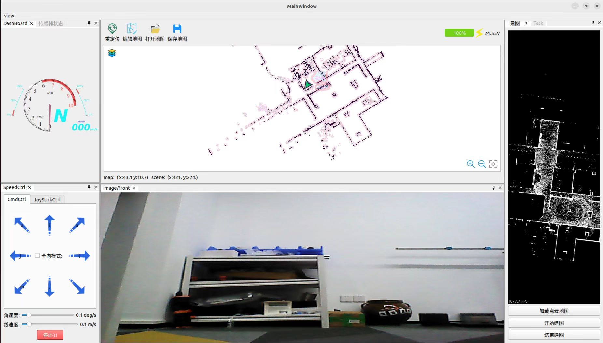

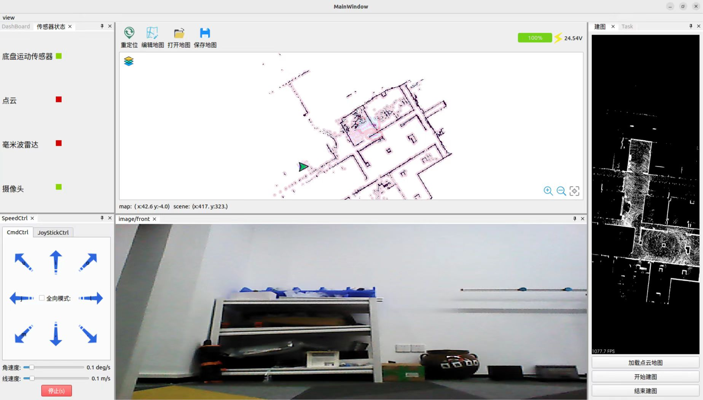


# 一,Release 版本下载使用

如æœæ‚¨åªæƒ³ä½¿ç”¨æœ¬è½¯ä»¶,并ä¸æƒ³äº†è§£å…·ä½“的代ç å®ç°,用户å¯ä»¥é€‰æ‹©ä¸‹è½½ç¼–译好的Release版本，ä¸ç”¨è‡ªè¡Œæ‰‹åŠ¨ç¼–译,下载å³ç”¨

使用Release版本的å‰æ:==系统ROSç¯å¢ƒå·²å®‰è£…,并且source到ç¯å¢ƒå˜é‡ä¸­==

本仓库使用CI自动生æˆå„å¹³å°çš„Release版本(ç›®å‰åªæœ‰X86_64版本,Armç¯å¢ƒéœ€è¦è‡ªè¡Œç¼–译),在项目的[Release页é¢](https://github.com/chengyangkj/Ros_Qt5_Gui_App/releases)下载最新对应ROS版本的Release版本，ç†è®ºä¸Šè§£å‹åå³å¯ä½¿ç”¨ã€‚
使用方法:
在终端进入解å‹å的文件夹路径,执行如下命令:

```
sudo chmod a+x ./ros_qt5_gui_app
./ros_qt5_gui_app
```
如æœRelease版本下载å使用ä¸äº†ï¼Œå¯ä»¥å‚考[二,编译](#二编译)进行自行编译使用

# 二,编译


>💡 注æ„，为了ä¿è¯æ­¤é¡¹ç›®åŒæ—¶å…¼å®¹ROS1ä¸ROS2，此项目ä¸ä½¿ç”¨ROS1/ROS2çš„catkin_make/colconæ„建系统进行够建，而是使用标准CMake进行æ„建，这也就æ„味ç€ï¼Œæœ¬é¡¹ç›®ä¸ä¼šè¢«ROS自动识别为功能包
å¯ä»¥å‚考以下教程ä»0开始æ„建/è¿è¡Œæ­¤é¡¹ç›®:

## 1,ç¯å¢ƒå®‰è£… 

ç†è®ºä¸Šåªéœ€è¦å®‰è£…如下基础包就å¯ä»¥ç¼–译此项目:

```
sudo apt-get update
sudo apt-get install qtbase5-private-dev libqt5svg5-dev libsdl-image1.2-dev libsdl1.2-dev -y
```

如æœä»¥ä¸Šå®‰è£…å还ä¸è¡Œï¼Œå¯ä»¥æ‰§è¡Œå¦‚下指令安装全部ä¾èµ–:

```
sudo apt-get install qtbase5-dev qt5-qmake qtbase5-dev-tools libqt5svg5-dev qtbase5-private-dev libeigen3-dev libgtest-dev libsdl-image1.2-dev libsdl1.2-dev -y
```

## 2,克隆/下载本项目:


```
mkdir -p ~/qt_ws
cd ~/qt_ws
git clone https://github.com/chengyangkj/Ros_Qt5_Gui_App
```

note:如æœgithub下载过慢,å¯ä»¥ä½¿ç”¨ä»¥ä¸‹æŒ‡ä»¤ä»gitee拉å–

```
git clone https://gitee.com/chengyangkj/Ros_Qt5_Gui_App

```

## 3,编译项目

å¯ä»¥æ‰‹åŠ¨æ‰§è¡Œå¦‚下命令进行编译(会根æ®ç¯å¢ƒå˜é‡è‡ªåŠ¨è¯†åˆ«ROS1还是ROS2ç¯å¢ƒ):
```
cd ~/qt_ws/ROS2_Qt5_Gui_App
mkdir -p build
cd build
cmake ..
make

```
或者执行如下脚本手动指定ROS版本并进行一键编译:

```
cd ~/qt_ws/ROS2_Qt5_Gui_App

```
ROS1:

```
sh ./build_ros1.sh

```
ROS2

```
sh ./build_ros2.sh
```
## 4,è¿è¡Œé¡¹ç›®

```
cd ~/qt_ws/ROS2_Qt5_Gui_App/build
./ros_qt5_gui_app

```

软件é…置文件路径(è¿è¡Œä¸€æ¬¡è½¯ä»¶å会自动生æˆåœ¨å¯æ‰§è¡Œç¨‹åºç›¸å¯¹è·¯å¾„下)

# 三,IDEé…置说æ˜(QtCreator/Vscode)


>💡  此部分为针对新手åšçš„温馨æ示,如æœä½ å·²ç»æ˜¯ä¸€ä¸ªROS/C++/Qtè€æ‰‹,å¯ä»¥è·³è¿‡æ­¤éƒ¨åˆ†


很多ROSåˆå­¦è€…学习Qt都存在一个误区:没有æ清楚IDEä¸ç¼–译器的区别，åƒQtCreator，Vscode，CLion之类的å‡ä¸ºIDE（[什么是IDE](https://www.zhihu.com/question/24833708)）
哪怕ä¸ç”¨IDE，我们åªç”¨æ–‡æœ¬ç¼–辑器也能å®ç°ä»£ç çš„编写(效ç‡å¾ˆä½ï¼Œæ²¡æœ‰ä»£ç æ示)，编写之å使用make指令编译å³å¯

å®é™…上Ubuntu系统默认都自带的有Qt库,就比如å‰é¢çš„[3,编译项目](#3编译项目),并没有è¦æ±‚安装QtCreator,åªéœ€è¦ä½¿ç”¨apt-get安装一些系统缺失的,没有默认安装的qt库,就能正常编译通过

当然安装QtCreator时也会åŒæ—¶ä¸‹è½½ä¸€äº›Qt库,但是他仅仅是下载,如æœä½ æ²¡æœ‰å°†ä¸‹è½½çš„库添加到ç¯å¢ƒå˜é‡ä¸­(通常也ä¸å»ºè®®è‡ªå·±å°†ä¸‹è½½çš„qt库添加到ç¯å¢ƒå˜é‡ä¸­,这样需è¦å¤„ç†ç³»ç»Ÿé»˜è®¤çš„qt库ä¸ä½ æ·»åŠ çš„qt库的冲çªé—®é¢˜),所以,在没有é¢å¤–é…置的情况下,虽然下载了QtCreator,但是在编译代ç æ—¶ç”¨çš„还是系统默认的库.

那么,我们为什么还è¦å»é¢å¤–下载QtCreatorå‘¢?

因为我们需è¦ä½¿ç”¨QtCreatorå»ç¼–辑我们的(.ui),(.resource)文件，åŒæ—¶QtCreator还æ供了代ç æ示，代ç è·³è½¬ç­‰åŠŸèƒ½ã€‚但是这些功能，åªè¦æ˜¯IDEå‡æœ‰è¿™ä¸ªåŠŸèƒ½ï¼Œæˆ‘们通过Vscode/Clion安装一些æ’件，也是能够å®ç°è¿™äº›åŠŸèƒ½ï¼Œåªæ˜¯QtCreator对自家的语言支æŒçš„比较好，比较方便

本项目所有的界é¢,都是在代ç ä¸­å»æ‰‹åŠ¨åˆ›å»º,如æœæ‰“开代ç ä¸­çš„mainwindow.uiå¯ä»¥å‘ç°ä»€ä¹ˆéƒ½æ²¡æœ‰,因为所有界é¢éƒ½æ˜¯ä»£ç åŠ¨æ€åˆ›å»ºæ·»åŠ ä¸Šå»çš„.

本人在开å‘本项目的æµç¨‹ä¸º:
 - 使用系统的Qt库,如æœéœ€è¦ä½¿ç”¨çš„qt库ä¸å­˜åœ¨,则使用apt-get安装å³å¯
 - 所有uiç•Œé¢å‡ä½¿ç”¨ä»£ç åŠ¨æ€åˆ›å»º,并添加到主窗å£ä¸­,没有使用qtcreator拖拽生æˆ
 - 项目的开å‘IDE使用vscode,仅安装了基础的c/c++æ’件åšä»£ç æ示
 - 如æœéœ€è¦ç¼–辑资æºæ–‡ä»¶(.qrc),手动打开qtcreator,å†æ‰“å¼€qrc文件进行编辑ä¿å­˜
 - 编译时在终端使用make指令进行编译
 - è¿è¡Œæ—¶åœ¨ç»ˆç«¯ä½¿ç”¨./ros_qt5_gui_app指令进行è¿è¡Œ

å¯ä»¥å‘ç°,å¼€å‘此项目åªæœ‰éœ€è¦ç¼–辑资æºæ–‡ä»¶æ—¶æ‰ä¼šç”¨åˆ°QtCreator(一般图片添加上å»å也ä¸ä¼šåšé¢‘ç¹çš„编辑)

虽然本人开å‘使用的Vscode,但是为了方便部分习惯使用QtCreatoråšå¼€å‘的用户,这里介ç»ä¸‹å¦‚æœä½¿ç”¨QtCreator作为IDEå¼€å‘此项目:

### 3.1 QtCreator打开项目教程

首先需è¦æŒ‰ç…§[3,编译项目](#3编译项目)将项目æˆåŠŸç¼–译,如æœç¼–译失败,则QtCreator打开å项目ä¸ä¼šæ­£å¸¸å±•å¼€

本项目为标准CMake项目,因此按照在QtCreator中打开CMake项目的方å¼,打开本项目的根目录Cmakelist.txtå³å¯(ä¸åŒºåˆ†ROS1/ROS2)

- 1.安装QtCreator

```
sudo apt-get install qtcreator

```
- 2.打开qtcreator

终端输入(必须终端打开):

```
qtcretor
```
打开å选择文件->打开文件或项目:

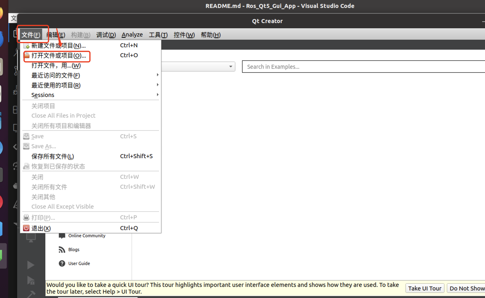

æ¥ç€é€‰æ‹©é¡¹ç›®==根目录==下的Cmakelist.txt文件,点击打开å³å¯:

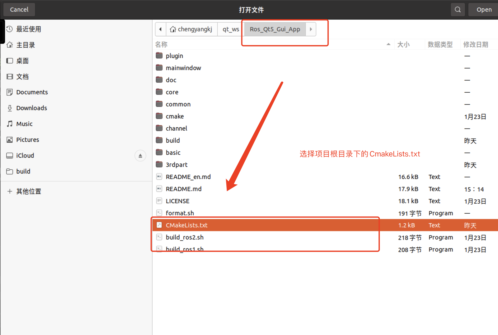

æ¥ç€ä¼šè‡ªåŠ¨è¯†åˆ«æˆ‘们å‰é¢ç¼–译的build目录,选择config:

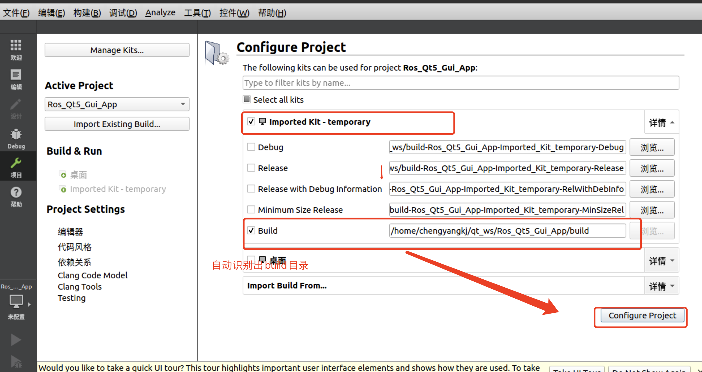

项目æˆåŠŸå±•å¼€,点击绿色三角形编译并è¿è¡Œ:

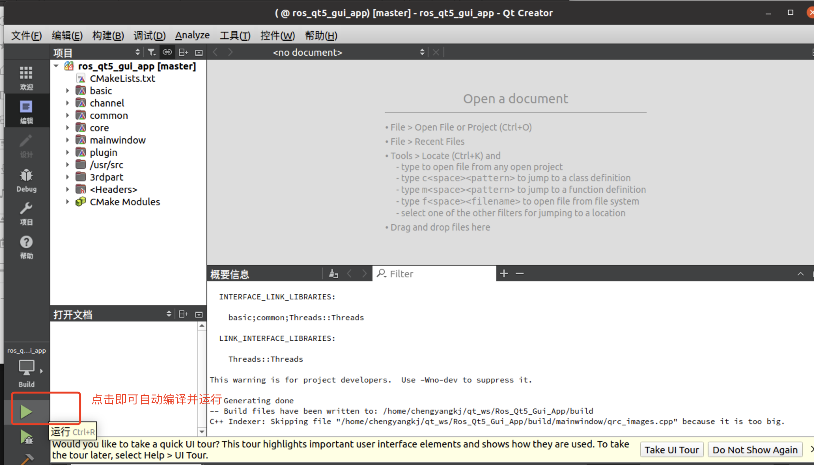

# å››,使用说æ˜

### 4.1,多机通信é…ç½®

>💡  针对äºROS新手的温馨æ示:此项é…ç½®,如æœæ˜¯å•æœºä½¿ç”¨å³æœ¬è½¯ä»¶è¿è¡Œåœ¨æœºå™¨äººèº«ä¸Š,没有跨机器使用就ä¸ç”¨é…置，直æ¥è·³è¿‡å³å¯.如æœéœ€è¦å°†æœ¬è½¯ä»¶è¿è¡Œåœ¨è‡ªå·±çš„笔记本上,å»è¿æ¥è¿œç¨‹çš„机器人的情况下需è¦è¿›è¡Œé…ç½®


ROS1/ROS2的多机通信完全ä¾èµ–ROSåŸç”Ÿ(ç¯å¢ƒå˜é‡æ·»åŠ ROS_MASTER_URIä¸ROS_IP/ROS_DOMAINID),ä¸å†ç”±ç”¨æˆ·æ‰‹åŠ¨æŒ‡å®š,å‡è½»æ–°æ‰‹ä½¿ç”¨è´Ÿæ‹…

ROS1:

é…ç½®å‚考：多机通讯教程[csdn åšå®¢](https://blog.csdn.net/qq_38441692/article/details/98205852)

ROS2:

ç¯å¢ƒå˜é‡å¤šæœºé…置相åŒçš„ROS_DOMAINID

### 4.2,é…置文件

第一次è¿è¡Œå，会在å¯æ‰§è¡Œç¨‹åºåŒçº§ç›®å½•ç”Ÿæˆconfig.json,修改此é…置文件å³å¯(需è¦æ³¨æ„Jsonæ ¼å¼),修改åé‡å¯ç”Ÿæ•ˆ,具体é…置说æ˜è¯¦è§å„功能的é…置说æ˜


### 4.3,é‡å®šä½ä½å§¿æ€å‘布

程åºå¯ä»¥æ‹–动å¼çš„设置机器人åˆå§‹ä½ç½®ï¼ˆé‡å®šä½ï¼‰,相对äºRviz,拖动时å¯ä»¥å®æ—¶æŸ¥çœ‹æ¿€å…‰åŒ¹é…情况,é‡å®šä½æ›´åŠ ç²¾å‡†(左键按ä½æ‹–动,å³é”®æ—‹è½¬æ–¹å‘)

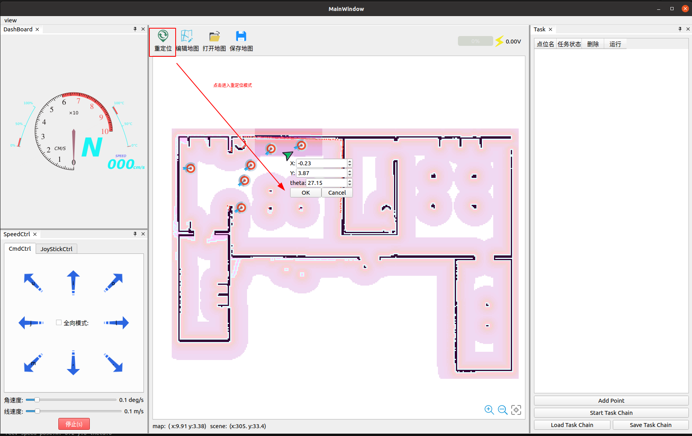

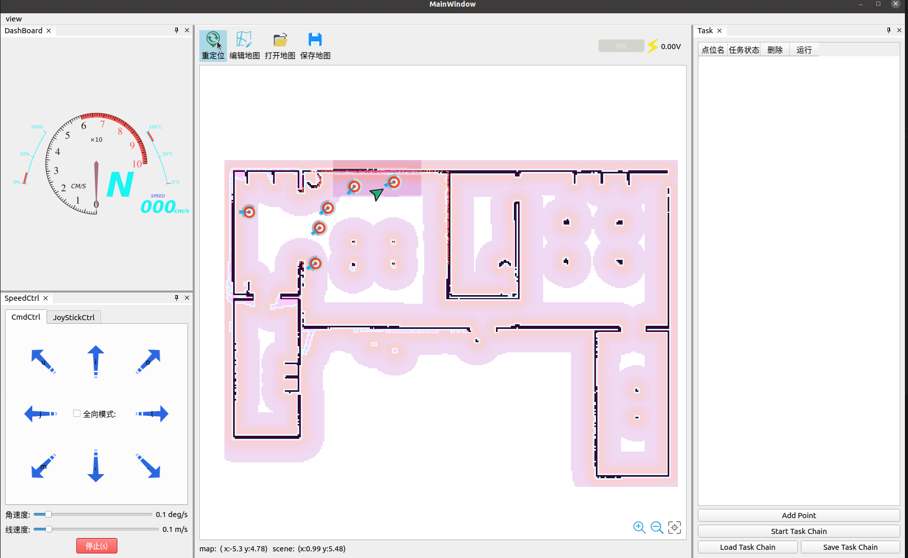

注æ„:如æœè®¾ç½®æ— æ•ˆ,需è¦æ£€æŸ¥config.json中设置：

```
{
      "display_name": "Reloc",
      "topic": "/initialpose",
      "enable": true
}
```
为自己机器人监å¬çš„é‡å®šä½Topicå称


### 4.4,地图编辑

程åºæ”¯æŒåœ°å›¾ç¼–辑功能:

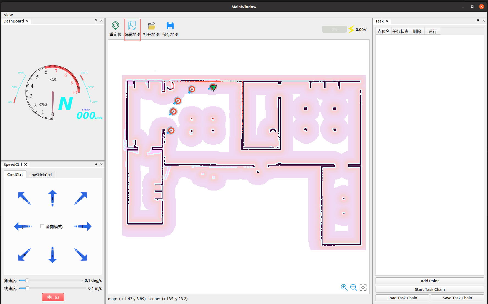
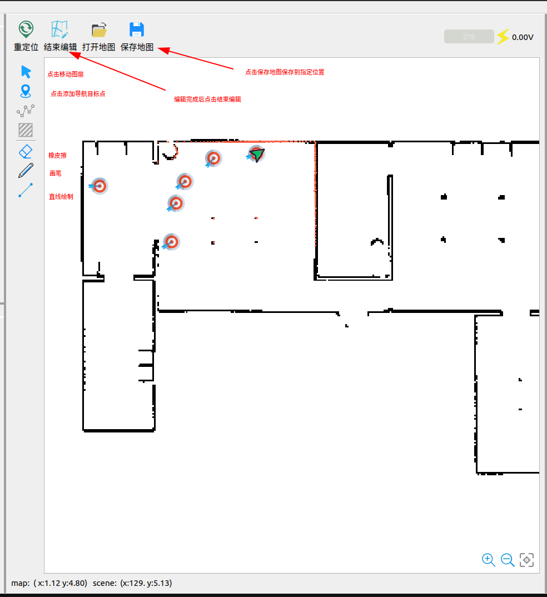

#### 4.4.1 拓扑地图(机器人导航点设置)
并且程åºæ”¯æŒæ‹“扑地图功能,å¯ä»¥æ‹–动å¼çš„设置机器人导航目标点（导航）使用gif说æ˜å¦‚下:

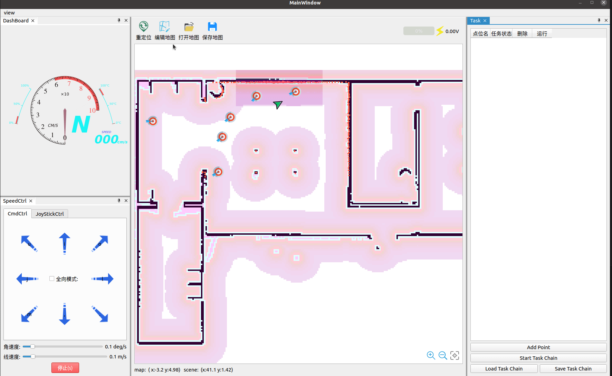

注æ„:如æœå¯¼èˆªç‚¹ä½å‘布无å“应设置无效,需è¦æ£€æŸ¥config.json中设置：

```
{
      "display_name": "NavGoal",
      "topic": "/move_base_simple/goal",
      "enable": true
}
```
为自己机器人监å¬çš„导航目标点Topicå称

#### 4.4.2 橡皮擦

点击橡皮擦å,å¯ä»¥æ“¦é™¤åœ°å›¾ä¸­çš„éšœç¢ç‰©,使用gif说æ˜å¦‚下:
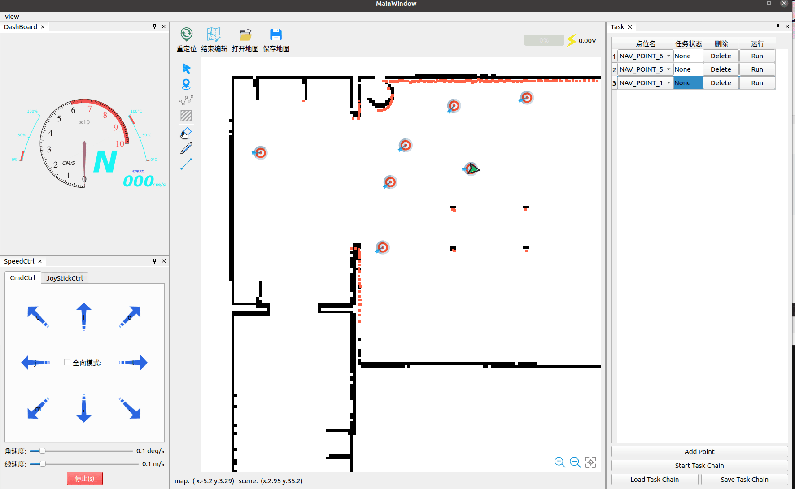

#### 4.4.3 画笔
画笔功能
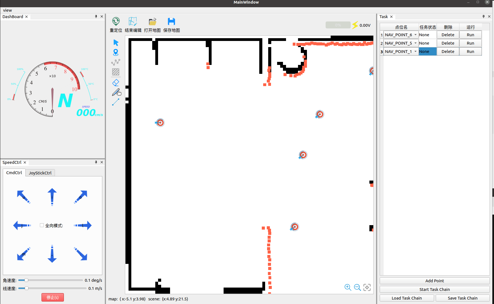

#### 4.4.4 线段绘制
线段绘制
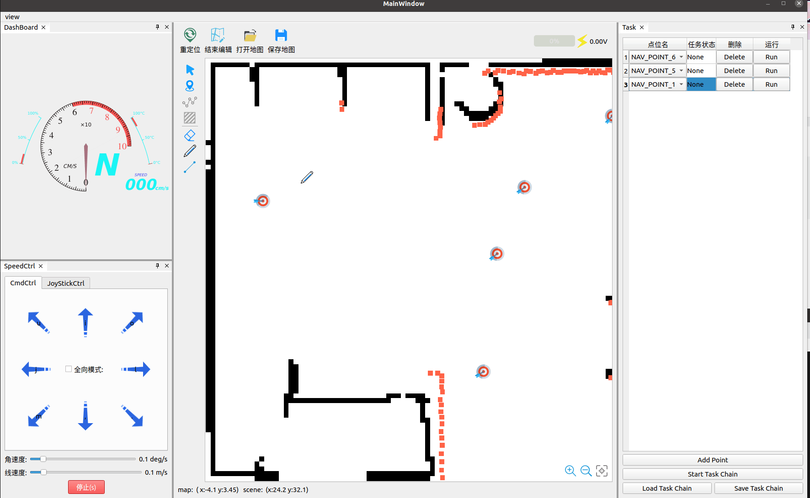

#### 4.4.5 地图ä¿å­˜

地图编辑完æˆå并ä¸ä¼šè‡ªåŠ¨ä¿å­˜,需è¦ç‚¹å‡»ä¿å­˜æŒ‰é’®,ä¿å­˜åœ°å›¾åˆ°æŒ‡å®šæ–‡ä»¶å¤¹,如æœéœ€è¦åœ¨ROS中使用，需è¦å°†è¯¥åœ°å›¾æ›¿æ¢åˆ°è‡ªå·±å¯¹åº”导航包的map中

ç›®å‰ä¿å­˜åœ°å›¾æœ‰å¦‚下:

- *.pgm 图片数æ®
- *.yaml 地图æ述文件
- *.topology 程åºè‡ªå®šä¹‰çš„拓扑地图 ä¿å­˜äº†ç‚¹ä½ç­‰ä¿¡æ¯

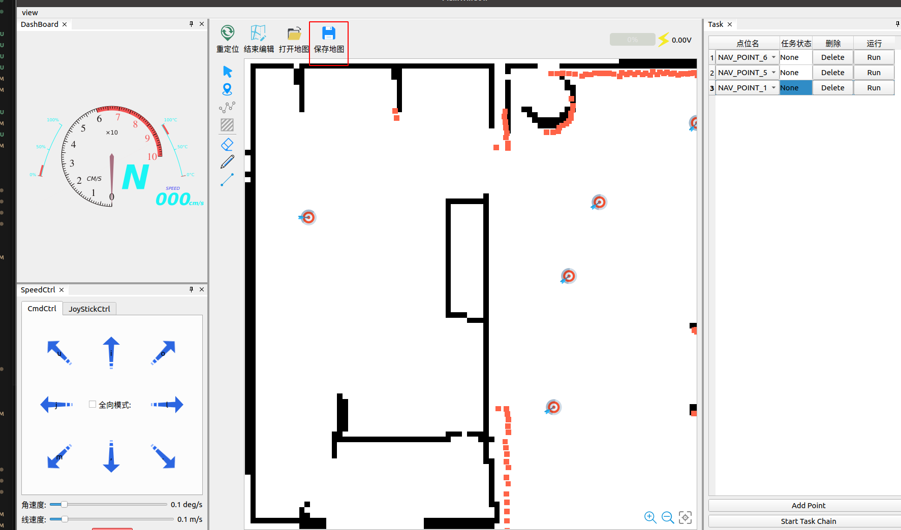

#### 4.4.6 地图加载

地图加载åŒç† 用户选择对应的PGM地图文件å³å¯åŠ è½½ï¼Œå¹¶è¿›è¡Œç¼–辑

### 4.5,手动æ§åˆ¶æœºå™¨äºº

软件支æŒå‘布å®æ—¶é€Ÿåº¦åˆ°åº•ç›˜:

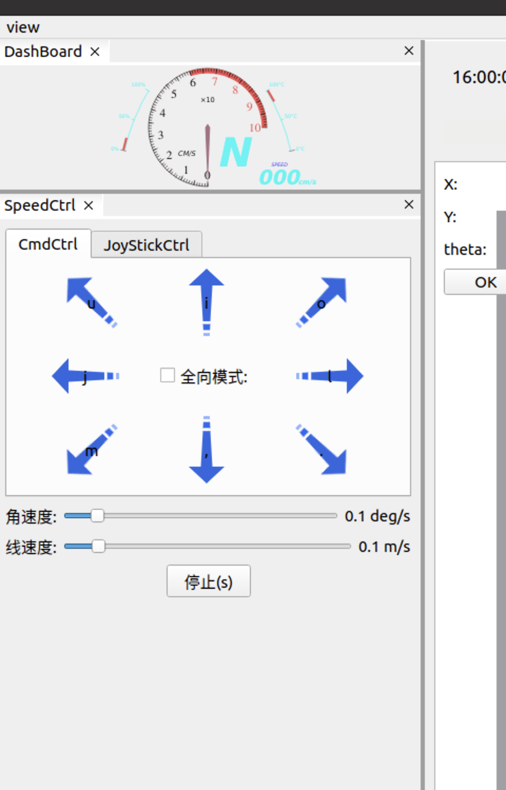

对应按钮上的文字，å¯ä»¥ç”±é”®ç›˜å¯¹åº”按钮åŒæ­¥è°ƒç”¨

注æ„:如æœè®¾ç½®æ— æ•ˆ,需è¦æ£€æŸ¥config.json中设置：

```
{
      "display_name": "Speed",
      "topic": "/cmd_vel",
      "enable": true
}

```
为å®é™…机器人监å¬çš„速度æ§åˆ¶è¯é¢˜

### 4.6,速度仪表盘

软件支æŒå®æ—¶æ˜¾ç¤ºæœºå™¨äººé€Ÿåº¦:

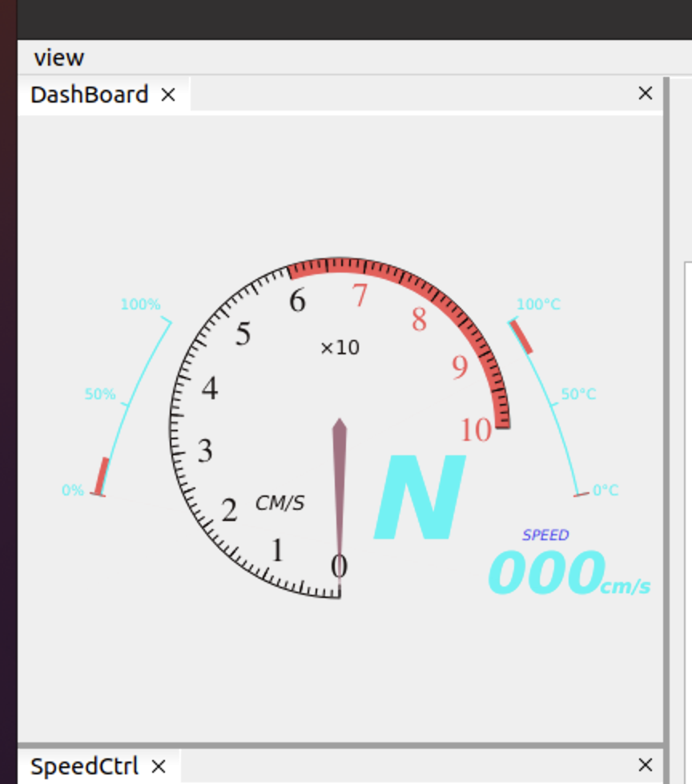

注æ„:如æœè®¾ç½®æ— æ•ˆ,需è¦æ£€æŸ¥config.json中设置：

```
{
      "display_name": "Odometry",
      "topic": "/odom",
      "enable": true
}
```

为机器人时机å‘布的里程计è¯é¢˜

### 4.7,电池电é‡æ˜¾ç¤º

软件支æŒå®æ—¶æ˜¾ç¤ºæœºå™¨äººç”µé‡,在é…置中é…ç½®è¯é¢˜å，电池电é‡çš„Topicç±»å‹ä¸º:sensor_msgs::BatteryState

```
{
      "display_name": "Battery",
      "topic": "/battery",
      "enable": true
}
```


### 4.8 多点è¿ç»­å¯¼èˆª

软件支æŒå¤šç‚¹è¿ç»­å¯¼èˆª,使用方法如下:

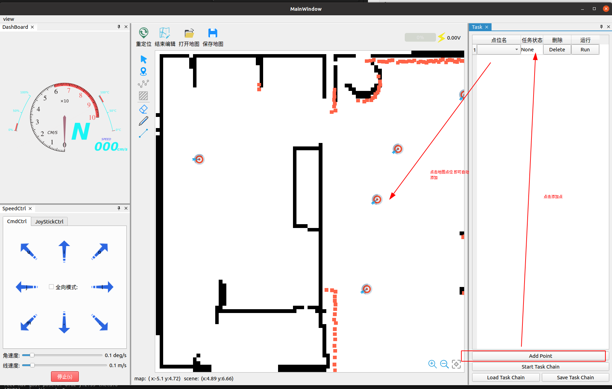

点击Start Task Chainå³å¯å¼€å§‹ä»»åŠ¡:


### 4.9,相机图片显示

软件支æŒå®æ—¶æ˜¾ç¤ºæœºå™¨äººç›¸æœºå›¾ç‰‡,在é…置中é…ç½®è¯é¢˜ååŠlocation:

```
  "images": [ ], //图片列表 支æŒå¤šè·¯ é…ç½®å自动创建界é¢

```

软件移æ¤äº†rqt image view的图片显示功能,支æŒå®æ—¶æ˜¾ç¤ºå¤šè·¯æœºå™¨äººç›¸æœºå›¾ç‰‡,在é…置中é…ç½®è¯é¢˜å

é…ç½®demo:

```

  "images": [
    {
      "location": "front",
      "topic": "/camera/rgb/image_raw",
      "enable": true
    },
    {
      "location": "front/depth",
      "topic": "/camera/depth/image_raw",
      "enable": true
    }
  ],

```

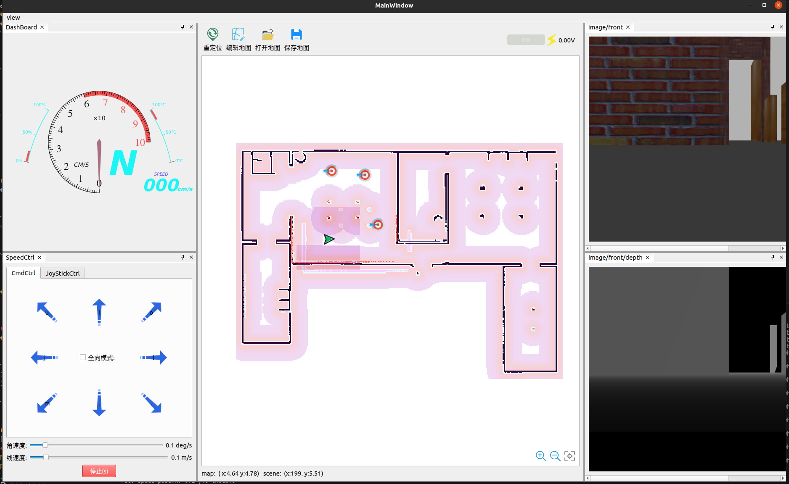


### 4.10,机器人车身轮廓显示

车身尺寸ä½äºé…ç½®:"robot_shape_config":

``` 

  "robot_shape_config": {
    "shaped_points": [],  //轮廓点
    "is_ellipse": false,  //轮廓是å¦ä¸ºæ¤­åœ†
    "color": "0x0000FF",   //轮廓填充颜色
    "opacity": 0.5     //轮廓é€æ˜åº¦
  }

```

é…ç½®å‰ï¼Œé¦–先需è¦ä»¥è½¦ä¸­å¿ƒä¸ºåŸç‚¹ï¼Œä½¿ç”¨å¦‚下å标系计算车身轮廓的æ¯ä¸ªç‚¹(å•ä½m)，支æŒå¼‚形车身:

```

                    ^x
                    |
                    |
                    |
          (0.5,0.5) |     (0.5,-0.5)
            +---------------+
            |       |       |
            |       |       |
            |       |       |
<----------------------------------------+
y           |       |       |
            |       |       |
            |       |       |
            |       |       |
            +---------------+
        (-0.5,0.5)  |       (-0.5,-0.5)
                    |
                    |


```

éšæ„找一个点作为起始点,按照顺时针,ä¾æ¬¡å¡«ä¸‹æ¯ä¸ªç‚¹

é…ç½®demo:

- 1m*1m车身:

```
  "robot_shape_config": {
    "shaped_points": [
      {
        "x": 0.5,
        "y": 0.5
      },
      {
        "x": 0.5,
        "y": -0.5
      },
      {
        "x": -0.5,
        "y": -0.5
      },
      {
        "x": -0.5,
        "y": 0.5
      }
    ],
    "is_ellipse": false,
    "color": "0x00000FF",
    "opacity": 0.5
  }

```

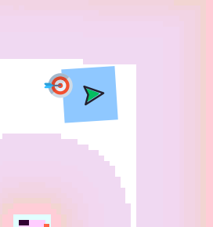

- 1m*1m 圆形车身:

is_ellipse=true

```
  "robot_shape_config": {
    "shaped_points": [
      {
        "x": 0.5,
        "y": 0.5
      },
      {
        "x": 0.5,
        "y": -0.5
      },
      {
        "x": -0.5,
        "y": -0.5
      },
      {
        "x": -0.5,
        "y": 0.5
      }
    ],
    "is_ellipse": true,
    "color": "0x00000FF",
    "opacity": 0.5
  }

```
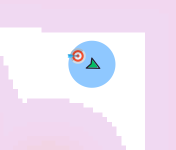

- 异形车身:
  
```
  "robot_shape_config": {
    "shaped_points": [
      {
        "x": 0.5,
        "y": 0.5
      },
      {
        "x": 1,
        "y": 0
      },
      {
        "x": 0.5,
        "y": -0.5
      },
      {
        "x": -0.5,
        "y": -0.5
      },
      {
        "x": -0.5,
        "y": 0.5
      }
    ],
    "is_ellipse": false,
    "color": "0x00000FF",
    "opacity": 0.5
  }

```

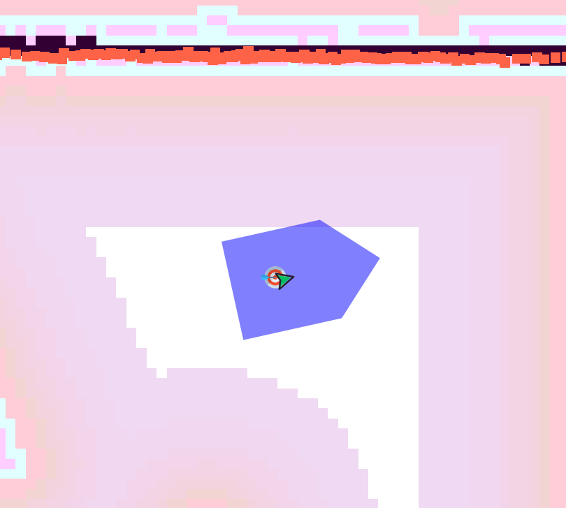


### 4.11,传感器状æ€æ˜¾ç¤º
软件å®ç°äº†ä¼ æ„Ÿå™¨çŠ¶æ€æ˜¾ç¤ºåŠŸèƒ½ï¼Œè¿™ä¸ªç•Œé¢å¯ä»¥æ ¹æ®å±å¹•å¤§å°è‡ªåŠ¨ç¼©æ”¾

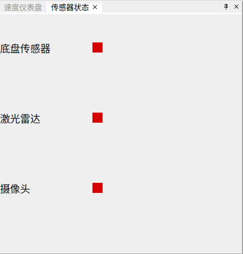


### 4.12,建图功能
软件å®ç°äº†å»ºå›¾åŠŸèƒ½å’ŒåŠ è½½å»ºå›¾ç»“æŸå显示上次建的图的点云功能


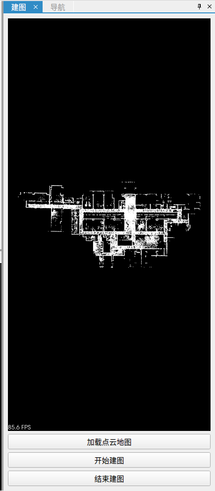

开始建图的功能是通过begin_mappingå’Œend_mapping两个槽函数å®ç°ï¼Œå¦‚æœæƒ³è¦åœ¨å…¶ä»–设备上è¿è¡Œï¼Œ
需è¦å…ˆåœ¨è‡ªå·±ç”µè„‘上é…ç½®sshå…密登陆功能，在将槽函数中的sshè¿æ¥çš„用户å，ip地å€ä»¥åŠå»ºå›¾çš„
指令修改一下，加载点云功能需è¦å°†åœ°å€ä¿®æ”¹ä¸ºä¸Šæ¬¡å»ºå®Œå›¾åä¿å­˜çš„地å€ï¼ŒåŠ è½½ç‚¹äº‘功能在loadAndShowPCD
函数中å®ç°

###rosbridge 功能正在å®ç°ä¸­


åŸæ–‡é“¾æ¥ï¼šhttps://github.com/chengyangkj/Ros_Qt5_Gui_App

